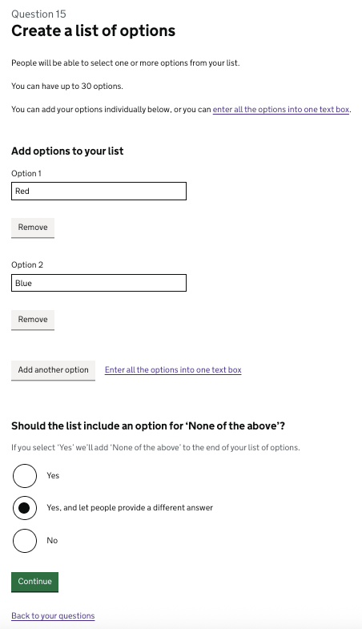
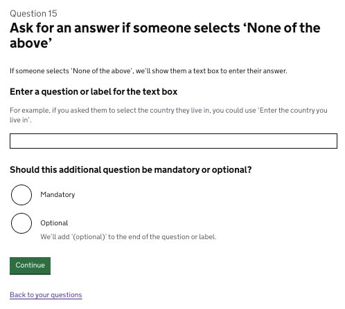
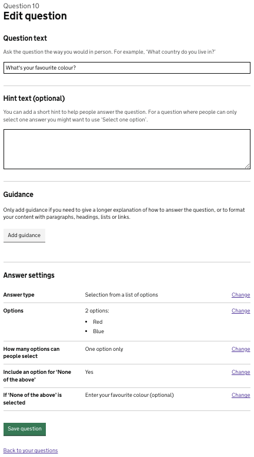
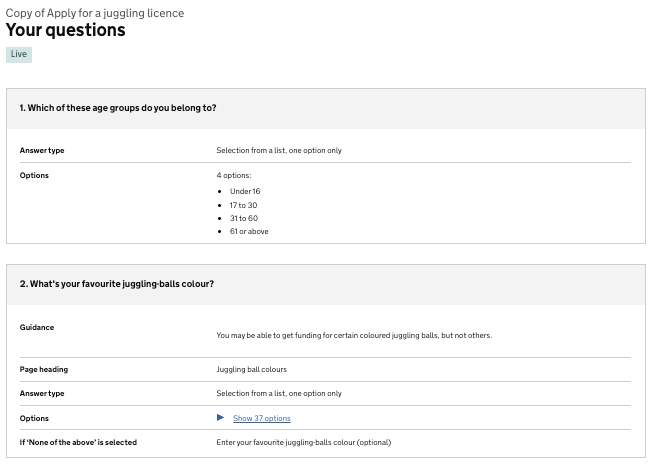
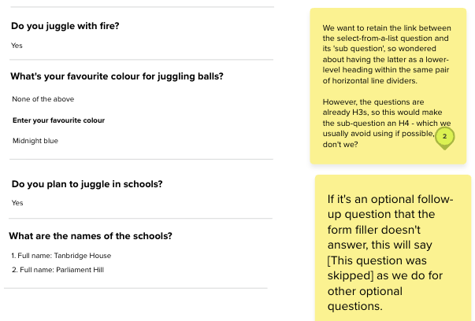
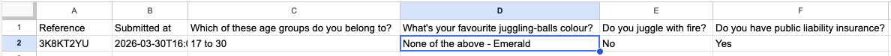
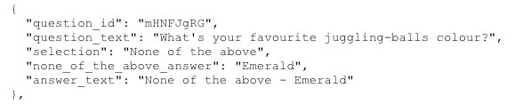
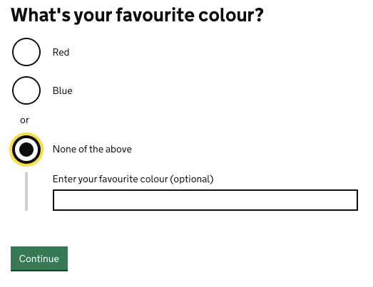
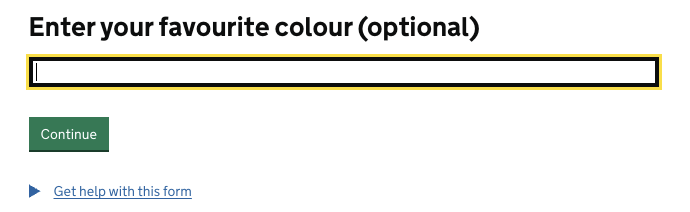
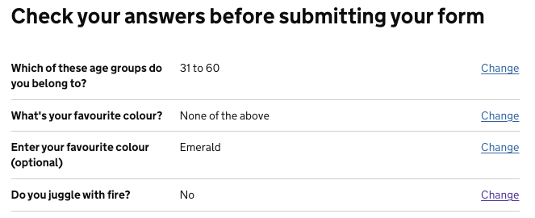

## Status
- Date released: 16 January 2026
- [Epic Trello card](https://trello.com/c/4G5NLRvN)
- [Let people add an answer if ‘none of the above’ is selected feature document](https://docs.google.com/document/d/1Urs-5dWqS5GVL283OfxaA7mPcAHpMpSa2UbLLIWO5hg/edit?pli=1&tab=t.0) 
- [Mural board](https://app.mural.co/t/gaap0347/m/gaap0347/1760012750571/b19691c8f6154638b5782f172d311831a63a7af4)

## Contents

- [What is this feature?](#what-is-this-feature)
- [Key decisions](#key-decisions)
- [Designs and content](#designs-and-content)
  
## What is this feature?
We allow users to select ‘None of the above’ when selecting from a list of options, but we don’t provide a way for them to specify what their answer would be.
We should let users describe what their ‘none of the above’ item would be, if form creators want to allow this.

### As-is
Form creators can add a ‘None of the above’ option to a list question. 

Form fillers can select this option, but they do not currently have a way to add what their ‘none of the above’ answer would be.

### To-be  
Form creators will be able to choose whether or not to let form fillers add an answer if they’ve selected ‘none of the above’ from a selection-list question. They’ll also be able to make adding an answer optional for form fillers. 

## Key decisions

### Scope 

It was agreed that the following was in scope:
  	
- Allow a none-of-the-above option with additional information on both radio and checkbox options 
- Allow form fillers to give additional information to a question where their answer does not fit the options provided
- Offer a single-line text input for a form fillers’ answer
- Form creators will add a label or question content for the text input
- Long list of options (for form filler) - with select/autocomplete component
- Make ‘none of the above’ information optional - we originally intended to make it mandatory as this was simpler, but the designs we decided on allowed us to include this choice

The following was agreed to be out of scope:

- Allow form creators to choose the answer type they want form fillers to give if selecting ‘none of the above’
- Allow form creators to ask for more than 1 answer type when none-of-the-above is selected
- Offer a multi-line text area for form filler’s answer
- Allow form creators to decide what the content for the none-of-the-above option is (for example, ‘Other’)

### Design decisions

- We’ll let form creators choose if they want to allow people to give a different answer if they select ‘none of the above’ to a selection question.
- We’ll add a new radio option when form creators answer the question ‘Should the list include an option for ‘None of the above’?’. As well as ‘Yes’ and ‘No’ options, form creators will be able to choose ‘Yes, and let people provide a different answer’. 
- If this new option is selected, we’ll show form fillers a text box to enter their answer when they select ‘None of the above’. We’ll need to ask form creators for a question or label for this new input field.
- We’ll let form creators select whether an answer to this ‘additional’ question is mandatory or not.
- We’ll use the standard form-filler error messages for radios, checkboxes and single lines of text. 
- When the initial question has a long list of options (and uses the select/autocomplete component), we'll add a second page for the additional 'none of the above' question - we checked that this would be possible without interfering with routing
- Even if someone selects ‘none of the above’ and types an answer in exactly the same way as one of the options in the original list, it should still be treated as a ‘none of the above’ answer for the purposes of routing. 
- We need to consider related changes in form submissions and in the details page for live or archived forms. 

### ‘Other’ v ‘none of the above’
We briefly talked about whether we should change ‘none of the above’ to ‘other’, or allow people to change the wording themselves. We’ve had some people ask about this in feedback and Zendesk requests. 

It was noted that ‘other’ implies that there IS a different answer, whereas ‘none of the above’ does not suggest this as much.

While it was agreed that ‘other’ might feel more appropriate than 'none of the above' if someone is able to add another answer, ‘none of the above’ works for both instances - where there is another answer AND where there is not. We think this is probably why we used ‘None of the above’ for list questions initially.

So while we’re not allowing people to select or change how it’s worded, we agreed to stick with ‘None of the above’ and leave any changes for a future iteration. 

## Designs and content

### Summary of new designs and content

When a form creator creates a ‘Selection from a list of options’ question, they add their question text, select ‘one option only’ or ‘one or more options’, and are then taken to a ‘Create a list of options’ page.

On this page, there’s an ‘Add options to your list’ legend, followed by text boxes where form creators can add the relevant answer options to their list. 

This is followed by an H2 heading that reads ‘Should the list include an option for none of the above?’. 

Previously, a form creator had only 2 radio button options to choose from - ‘Yes’ and ‘No’. Under ‘Yes’ the hint text said ‘If you select ‘Yes’ we’ll add ‘None of the above’ to the end of your list of options’. 

This new feature adds a third radio option with the label ‘Yes, and let people provide a different answer’. This sits between the ‘Yes’ and ‘No’ radio options.

The hint text has been moved from the ‘Yes’ radio option to under the H2 heading ‘Should the list include an option for ‘None of the above’?’. This is because there are now 2 ‘Yes’ options to choose from and it makes more sense to have the hint text at the top as it applies to both.

We've made the same changes to the equivalent question on the 'Enter your list’s options into a text box' page - which people can chose to use rather than entering the options individually.

We’ve added a new page that form creators will see if they choose to ask someone for an answer if they select ‘none of the above’. On this page, they’re asked to enter a question or label for the text box that form fillers will see. We provide hint text to help them do this more effectively.

Form creators can also select whether entering an answer for this ‘additional question’ should be mandatory or optional.

The designs and content that were edited or created for this feature are: 

- ‘Create a list of options’ page (iteration)
- ‘Enter your list’s options into a text box’ page (iteration)
- ‘Ask for an answer if someone selects ‘None of the above’’ page (new)
- ‘Edit question’ page (iteration)
- Live and archived forms’ questions page (iteration)
- Submission email (iteration)
- CSV file (iteration)
- JSON file (iteration)
- Question X, for radio and checkboxes - form filler additional question view (iteration) 
- Question X, autocomplete - form filler view (iteration) 
- Question Xa, autocomplete - form filler view (new)
- ‘Check your answers’ page - form filler view (iteration) 

### ‘Create a list of options’ page - new radio option

**Description of the image and changes made:**

This screenshot shows the H1 page heading ‘Create a list of options’. This is the third page form creators will see when creating a ‘Selection from a list of options’ question - after ‘What’s your question?’ and ‘How many options should people be able to select?’. 

The H1 is followed by content explaining how many options form fillers can select from the list and how they can do this.

Below that, form fillers can add options to their list in the usual way, adding more text boxes as needed. 

There’s then an H2 that reads: 

> Should the list include an option for ‘None of the above’?

This is followed by 3 radio options, the second of which is new: 

> - Yes
> - Yes, and let people provide a different answer
> - No

The new radio option, which says ‘Yes, and let people provide a different answer’, lets form creators ask someone for an answer if they select ‘none of the above’. 

If form creators select this option, they’ll be taken to the ‘Ask for an answer if someone selects ‘None of the above’’ page. 

If they select the ‘Yes’ or ‘No’ radio options instead, they’ll be taken straight to the ‘Edit question’ page, as usual. 

The new ‘none of the above’ radio option also appears on the page that form creators see if they choose to enter all the options into one text box.

### ‘Ask for an answer if someone selects ‘None of the above’’ - new page

**Description of the image:**

This screenshot shows the new page that lets form creators enter a question or label for the text box form fillers will see if they select ‘none of the above’.   

The H1 heading reads:

> Ask for an answer if someone selects ‘None of the above’

Below this is some text that says:

> If someone selects ‘None of the above’, we’ll show them a text box to enter their answer.

That’s followed by a label that reads:

> ‘Enter a question or label for the text box’

The hint text beneath this is:

> For example, if you asked them to select the country they live in, you could use ‘Enter the country you live in’

Beneath the text box where form creators can add their label or question is an H2 heading that reads:

> Should this additional question be mandatory or optional? 

We added the word ‘additional’ here to help form creators understand that we’re not referring to the main question.

As usual, the 2 radio buttons are labelled ‘Mandatory’ and ‘Optional’, and the hint text under ‘Optional’ says that we’ll add ‘Optional’ to the end of the question or label.  

### ‘Edit question’ page - new row under ‘Answer settings’

This screenshot shows the page that form creators see once they’ve added options to their select-from-a-list question.

The page’s H1 is ‘Edit question’. This is followed by the usual ‘Question text’ and ‘Hint text (optional)’ text boxes and the H2 heading ‘Guidance’. 
Beneath this is the usual H2 ‘Answer settings’ with a summary list showing 5 rows. Each row is divided by a grey horizontal line. 

The 5 row headings are:

> Answer type
> Options
> How many options can people select
> Include an option for ‘none of the above’
> If ‘none of the above’ is selected

The first 4 are the same as usual, but the fifth is new - ‘If ‘none of the above’ is selected’. Next to this is whatever value (or text)  the form creator has added as the additional question or label.

Beneath the summary list is the usual green ‘Save question’ button and a ‘Back to your questions’ link.

### Live form’s ‘Your questions’ page

**Description of the image and changes made:**

This screenshot shows the top part of a live ‘Your questions’ page. This is the page form creators see if they’ve made their form live and are viewing that form’s questions. (It also appears in this way on an archived form’s equivalent page.)

Under the H1 ‘Your questions’ are 2 summary cards, showing the form’s first 2 questions - these are both selection-from-a-list questions. 

Question 1’s summary card displays the question text in the usual way - bold text on a grey background in the first row. It has 2 more rows with bold row headers saying ‘Answer type’ and ‘Options’. 

Question 2’s summary card follows this same pattern, but it has an extra row which shows the new ‘none of the above’ additional answer option. 

The summary card title, in bold text on a grey background, reads:

> ‘2. What’s your favourite colour?’

This is followed by 3 rows, which read:

> Answer type: Selection from a list, one option only
> Options: Show 37 options [this is a clickable details component]
> If ‘none of the above’ is selected: Enter your favourite colour (optional)

The last row, with the row header ‘If ‘none of the above’ is selected’, is new. It shows whatever label text the form creator has chosen to add, and states if this is optional. 

We considered an alternative design for displaying this information. This added a separate ‘None of the above’ heading and section to the summary card. It had row headers - ‘Input label’, followed by the form creator’s question text or label, and ‘Is the input optional?’, followed by ‘Yes’ or ‘No’. We decided against this design as it was less concise, used less plain English and made the summary card for that answer significantly longer. 

### Showing ‘none of the above’ answer in a submission email

**Description of the image and changes made:** 

This screenshot shows a snippet of a Mural design for how a form filler’s additional ‘none of the above’ answer will appear in the submission email that form processors receive. 

There are 4 questions shown, each divided by a horizontal grey line. 

The second question is the relevant one for this feature. It shows a select-from-a-list question where someone has selected ‘None of the above’ and entered an additional answer.

The H3 question text reads:

> What’s your favourite colour for juggling balls?

The answer below is ‘None of the above’. 

Beneath this is the additional question or label text the form creator has added. This is an H4 and reads:

> Enter your favourite colour

The answer below is ‘Midnight blue’. 

There are 2 yellow post-it notes which show some discussion about this design decision. One is querying the use of an H4 heading but it was agreed that, although we may avoid using H4s for the web, it was fine in this instance. 

The other post-it specifies what should happen if the form creator makes the additional question optional. This reads:

> If it's an optional follow-up question that the form filler doesn't answer, this will say [This question was skipped] as we do for other optional questions.

### Showing ‘none of the above’ answer in CSV file

**Description of the image and changes made:** 

This screenshot shows how a form filler’s additional ‘none of the above’ answer will appear in a CSV file - if form creators have chosen to receive a CSV for a submitted form.

The CSV stores data in a tabular format similar to a spreadsheet and, in this screenshot, has 2 rows and 5 columns (A to E). 

The CSV data follows the usual format, with cell 1A showing the column header ‘Reference’ and cell 2A showing the reference number for this form. Cell 1B shows the header ‘Submitted at’ and cell 2b shows the time and date of submission. 

The following columns all have the question text in row 1, and the answer to that question in the cell below (row 2).

What’s new is that a form filler’s additional answer is shown in the same cell as the ‘None of the above’ response, separated by a hyphen. 

In this instance, the answer to column D’s question - ‘What’s your favourite juggling-balls colour?’ reads:

> None of the above - Emerald

If the additional question is optional and not answered, we agreed to show the text:

> ‘None of the above -’ 

We decided against having an extra column for the additional question’s text and answer, although there was discussion about this. There were concerns about whether form processors might want to separate the 2, and whether separating them with a hyphen within the same cell was enough. The overall consensus was that it’s more obvious that the additional answer is related to the ‘none of the above’ question if it’s in the same cell. This was considered important as the person processing the form might not be the person who created it. It also means the processor does not have to check whether one column has ‘None of the above’ before looking in another column for the related answer.

### Showing ‘none of the above’ answer in JSON file

**Description of the image and changes made:** 

This screenshot shows a snippet from a JSON file that illustrates how the additional ‘none of the above’ answer is shown in code for this sort of question.

Each line of code has keys named in the usual way - “question_id”, “question_text”, “answer_text”, etc. This is followed by the related value for that key.

What’s different here is that, as well as the key “selection” and the value “None of the above” - which is usual for a selection question - there’s an extra line of code which reads:

> “none_of_the_above_answer”: “Emerald”

Below this is the usual “answer_text” key. But instead of the value being “None of the above”, it includes the additional answer to the question, separated by a hyphen:

> “None of the above - Emerald”

This is consistent with how this data is presented in the CSV. 

The decision to present it in this way was based on advice from developers that we usually need feedback from real JSON users to know what works best. We plan to consider such feedback in the future.

### Form filler view of the feature

**Description of the image and changes made:** 

This screenshot shows what someone answering a select-from-a-list question with the option ‘None of the above’ will see if the form creator has chosen to let them add an additional answer.

The question here is “What’s your favourite colour”? This is followed by 2 radio options labelled “Red” and “Blue”. Below these is a grey text divider saying ‘“or” and a further radio button labelled “None of the above”. 

What’s new is that if someone selects “None of the above”, they’ll see a conditional reveal of the related question, as in this screenshot. It displays as a vertical grey line to the left of a text box with the input label above it.

The input label here reads:

> Enter your favourite colour (optional)

Below is the green ‘Continue’ button. 

The same pattern is used for checkboxes, but it changes slightly if the question uses select and autocomplete - as below.

**Description of the image and changes made:** 

This screenshot shows the new screen a form filler will see if they’ve chosen ‘None of the above’ from a long list of options using the autocomplete function. 

Instead of a conditional reveal on the same page, they’ll be taken to this new page. 

It shows the label “Enter your favourite colour (optional)” above a text box input for their answer. This is followed by the green ‘Continue’ button. 

### ‘Check your answers’ page - with additional ‘none of the above’ question 

This screenshot shows the usual ‘Check your answers before submitting your form’ page.

Beneath the heading are 4 rows. Each row header is in bold, followed by the answer and a ‘Change’ link at the far right end of each row. 

As usual, the selection question - which in this example is “What’s your favourite colour?” - appears as the row header. This is followed by the answer text “None of the above”, and a ‘Change’ link at the end of the row.

What’s new is the row immediately below this, which shows the additional ‘none of the above’ question. The row header for this reads: 

> Enter your favourite colour (optional)

It’s followed by the answer ‘Emerald’ and the ‘Change’ link at the end of the row. 
