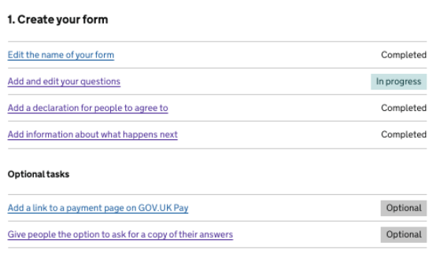
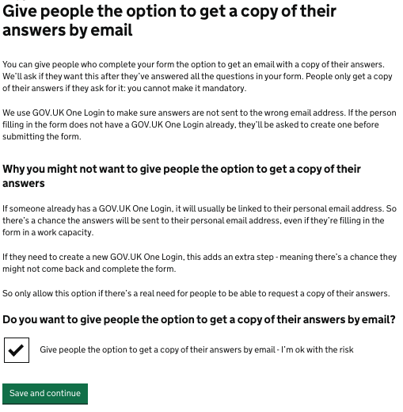
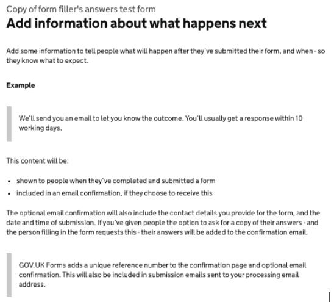
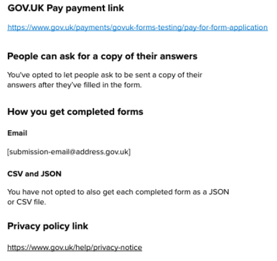
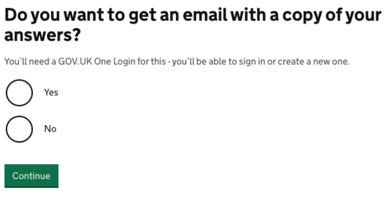
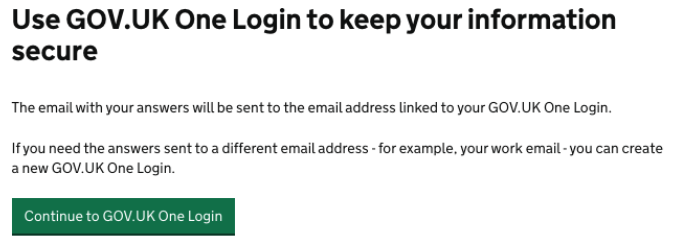
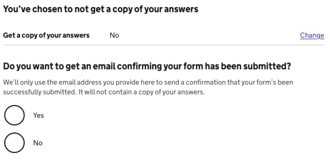
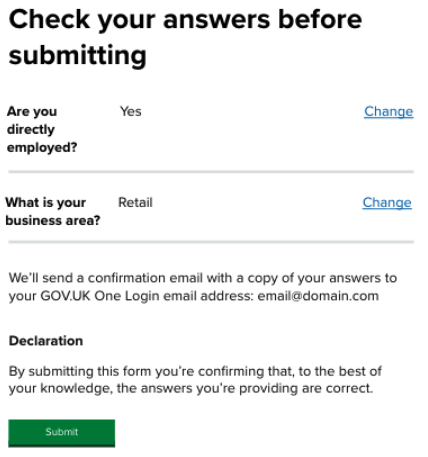
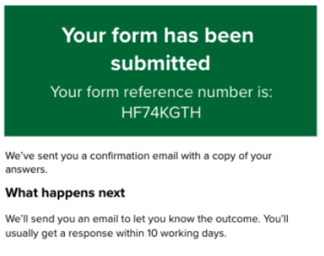
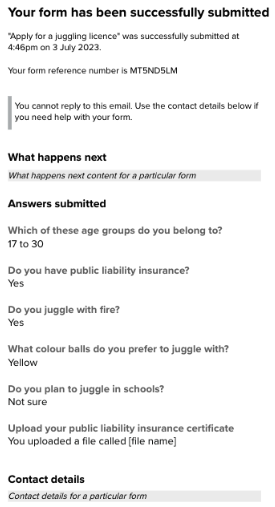

# Let form fillers get a copy of their answers

## Status

- Date released: 6 July 2026
- [Epic Trello card](https://trello.com/c/VG8QsupG/86-send-form-fillers-answers-to-them)
- [Copy of form filler’s answers feature document](https://docs.google.com/document/d/1pysSbSXhN6yJlpWnFFw1M6SkeLsacZTUNyC_KKz-8eo/edit?pli=1&tab=t.0) 
- [Mural board](https://app.mural.co/t/gaap0347/m/gaap0347/1770650530483/cb5b4a5307830bcb80a2969ee734560afbc7e098)

## Contents

- [What is this feature?](#what-is-this-feature)
- [Key decisions](#key-decisions)
- [Designs for form creators](#designs-for-form-creators)
- [Designs for form fillers](#designs-for-form-fillers)

## What is this feature?

Form fillers may want to get a copy of their answers, and form creators may want to allow this. Currently, there’s no way for this to happen. 

We should let form fillers get a copy of their answers if they want them, and if form creators are willing to allow this.

### As-is

Form fillers can choose to get a confirmation email after submitting their form. There’s no way for them to request a copy of their answers.

Form creators may want to let people get a copy of their answers, but there’s no way for them to enable this.

### To-be  

Form creators will be able to let people request a copy of their answers, though they won’t be able to make this mandatory. 

Form fillers will be able to request a copy of their answers in the optional confirmation email that’s sent after their form’s been submitted. 

To help make this more secure, we’ll require form fillers requesting a copy of their answers to log into their GOV.UK One Login account, or create a new one. They’ll be able to use the email address linked to their account to receive the confirmation email containing a copy of their answers. 

## Key decisions

Because of the data security considerations when emailing potentially sensitive submission data, we needed a way of making sure the data was sent to a verified email address.

Following a hackathon with GOV.UK One Login, we decided to use One Login’s email/password sign in for this purpose. 

This was partly because it lets us reuse GOV.UK products rather than creating something new, but also because One Login will be GOV.UK’s ‘sign in’ in the future - and it’s already the sign-in functionality for the GOV.UK App. 

The thinking was that form fillers who are already signed in or using the app will, in theory, have a smoother journey using this method. GOV.UK One Login integration will also be useful for GOV.UK Forms going forward as we can use its authentication for further features.

### Scope 

We agreed the following:
  	
- We’ll make it optional for form fillers to get a copy of their answers initially, and will monitor form creator usage/feedback on this
- The submission email to form creators won’t specify whether form fillers have opted to receive a confirmation email or not - we’ll wait for feedback from form creators about this
- We’ll use SES to send the confirmation email with a copy of someone’s answers

### Design decisions

The following points were considered during and after the hackathon with GOV.UK One Login. 

#### Where in the user journey should form fillers be able to request a copy of their answers? 

We considered various possibilities about where the option to request a copy of their answers should be presented to form fillers. 

These included:

- The ‘Check your answers’ page
- The start of the form
- After submitting the form (this would not work well with adding a payment link)
- A new page before the ‘Check your answers’ page

In the end, we decided to design a new page that form fillers would see after answering all the form’s questions but before the ‘Check your answers’ page where a form is submitted. 

#### Should we give form creators the option to turn this feature on for a form?

Initially we decided to turn this new feature on for all forms - so all form fillers would get the new page and the option to get a copy of their answers. 

We then reconsidered this and explored making it optional for form creators to add this to a form. That way, they could decide if form fillers should get this choice or not, depending on how relevant or useful it might be for their particular users.

The potential benefits of making this optional for form creators are that it would:

- allow the form creator to avoid the risk of their form fillers getting distracted or lost in the GOV.UK One Login journey unnecessarily - for example, if it’s not really relevant or useful for a specific form
- give us the opportunity to make sure they're aware of what this feature means for the form filler, when it might be useful to turn it on, and what the potential risks are
- place the responsibility for the choice and risk with the form creator rather than with GOV.UK Forms
- mean that this would not be automatically turned on for all forms, which would reduce risk generally for a new feature

This led to our decision that even if the feature is turned on by the form creator, form fillers should still get a choice about whether they want to receive a copy of their answers.

#### What if a form filler doesn’t complete the GOV.UK One Login part of the journey?

Our main concern after the Hackathon was what happens if the form filler doesn’t manage to complete the GOV.UK One Login part of the journey - they won’t get taken back to the form and will still not have submitted it. 

We considered ways to mitigate this risk and reconsidered the journey, but ended up sticking with our plan. 

We raised a feature request to improve this with GOV.UK One Login, but it isn’t likely to be dealt with very quickly. For now, we’ve tried to mitigate this risk as much as possible by outlining the potential risk in the new content for form creators. 

We decided to be explicit about the fact that this risk exists and that it’s for form creators to decide if they feel it’s a risk worth taking. By adding a checkbox to the new ‘Give people the option to get a copy of their answers by email’ page we aimed to reduce the chance of form creators enabling this feature without considering the possible consequences. The checkbox label is ‘Give people the option to get a copy of their answers by email - I’m ok with the risk’.

#### How might this affect routing-related content?

We agreed we’d need to make content changes to the way we talk about the place routes go to if someone goes to the end of the form. Up until now, we’ve said ‘Go to the check your answers page’, but this won’t work once the option to get a copy of your answers is turned on. 

We decided to change the wording to something more generic to allow for this.

We asked the devs to confirm whether any issues might be created by some forms having the page with this option and some not. They didn’t feel that we’d need to make any extra changes just because we’re making the feature opt-in. They planned to do a spike for changes to the runner as there would be different approaches to this.

## Designs for form creators

This feature required a combination of new content and iterations to existing content for form creators and form fillers. 

Welsh translations were also needed for new form-creator facing content.  

### Form-creator journey: summary

The following content for form creators was created or iterated for this feature: 

- ‘Create a form’ task list page - new optional task (iteration)
- ‘Give people the option to get a copy of their answers by email’ page (new)
- ‘Add information about what happens next’ page - new sentence if someone wants a copy of their answers (iteration)
- Live form view - new section if people can ask for a copy of their answers (iteration)
- Routing-related content - refers to the ‘end of the form’ instead of ‘Check your answers before submitting’ (iteration)

The form-creator journey for this feature starts with a new optional task on the task-list page. If selected, this leads to a new page that allows form creators to give people the option to get a copy of their answers by email. 

If a form creator selects the checkbox and clicks ‘Save and continue’, a success banner confirming that people will be able to get a copy of their answers appears. If they click ‘Save and continue’ without selecting the checkbox, a success banner confirming that people will not be able to get a copy of their answers will show instead.

If the feature is enabled, the ‘what happens next’ page will include a new sentence stating that a form filler’s answers will be added to a confirmation email when they’ve submitted their form. The ‘live form view’ page will also display a new section stating that ‘People can ask for a copy of their answers’.

The terminology used when routing someone to the end of the form has also changed - it’s now more generic (‘end of form’) rather than sending someone to the ‘Check your answers’ page, as this no longer works in all use cases. 

### ‘Create your form’ task-list page - new task added

**Description of the image and changes made:**

This screenshot shows the first section of the ‘Create a form’ task-list page - the H2 heading is ‘1. Create your form’. 

The first 4 rows show the mandatory tasks within this section, such as ‘Edit the name of your form’ and ‘Add and edit your questions’. At the end of each row is the status label for each task, such as ‘Not started’, ‘In progress’, or ‘Completed’.

Beneath this is the H3 heading ‘Optional tasks’ followed by two optional task links, along with status labels, which read:

> Add a link to a payment page on GOV.UK Pay - Optional
> 
> Give people the option to ask for a copy of their answers - Optional

This second task is the new one. If selected, it takes form creators to the page that allows them to enable this feature for their form.

### ‘Give people the option to get a copy of their answers by email’ - new page 

**Description of the image and changes made:**

This screenshot shows a new page with the H1 heading:

> Give people the option to get a copy of their answers by email

The text below reads:

> You can give people who complete your form the option to get an email with a copy of their answers. We’ll ask if they want this after they’ve answered all the questions in your form. 
>
> People only get a copy of their answers if they ask for it: you cannot make it mandatory.
We use GOV.UK One Login to make sure answers are not sent to the wrong email address. 
>
> If the person filling in the form does not have a GOV.UK One Login already, they’ll be asked to create one before submitting the form.

This is followed by an H2 heading that reads:

> Why you might not want to give people the option to get a copy of their answers

The text below reads:

> If someone already has a GOV.UK One Login, it will usually be linked to their personal email address. So there’s a chance the answers will be sent to their personal email address, even if they’re filling in the form in a work capacity.
>
> If they need to create a new GOV.UK One Login, this adds an extra step - meaning there’s a chance they might not come back and complete the form.
>
> So only allow this option if there’s a real need for people to be able to request a copy of their answers.

There’s then another H2 heading that reads: 

> Do you want to give people the option to get a copy of their answers by email?

This is followed by a checkbox input and the label:

> Give people the option to get a copy of their answers by email - I’m ok with the risk

Form creators must check this box if they want to to allow form fillers to request a copy of their answers. 

There’s then a green ‘Save and continue’ button.

### ‘Add information about what happens next’ page - new sentence added

**Description of the image and changes made:**

This screenshot shows the page with the H1 heading ‘Add information about what happens next’.

The content has stayed largely the same and summarises what people can do on this page, which is to add information telling people what will happen after they’ve submitted their form. There’s also an example of some possible wording using inset text. 

The page also explains when the content will be shown - once someone’s submitted a form, and in the optional email confirmation. 

The only change is the addition of a second sentence to this final paragraph about the optional email confirmation. This now reads:

> The optional email confirmation will also include the contact details you provide for the form, and the date and time of submission. If you’ve given people the option to ask for a copy of their answers - and the person filling in the form requests this - their answers will be added to the confirmation email.

There’s then more inset text explaining that a unique GOV.UK Forms reference number will be added to the confirmation page and email. 

### Live form view - new heading added

**Description of the image and changes made:**

This screenshot shows a snippet of the Mural design for the live form view of a page - this is the page that form creators will see once they’ve published their form. 

The screenshot shows a number of the H3 headings on this page, from the ‘What happens next information’ H3 down to the ‘Privacy policy link’ H3.

The new heading sits below the H3 ‘GOV.UK Pay payment link’, and above the ‘How you get completed forms’ H3. This mirrors the ordering on the task list page. 

The new H3 heading reads:

> People can ask for a copy of their answers

The content below this reads:

> You’ve opted to let people ask to be sent a copy of their answers after they’ve filled in the form

## Designs for form fillers

### Form-filler journey: summary

The following content for form fillers was created or iterated for this feature: 

- ‘Do you want to get an email with a copy of your answers?’ page (new)
- ‘Use GOV.UK One Login to keep your information secure’ page (new) - only for those who choose to get a copy of their answers 
- ‘Check your answers before submitting’ page (iteration) - 2 different versions, depending on whether someone wants a copy of their answers or not 
- ‘Your form has been submitted’ page (iteration) - only for those who choose to get a copy of their answers (iteration)
- Confirmation email with copy of a form filler’s answers (iteration) - email includes answers, if someone’s requested this

The form-filler journey now varies depending on whether someone chooses to get a confirmation email with a copy of their answers or not, if enabled. 

If they want a copy of their answers their journey will involve being taken through the GOV.UK One Login journey before being returned to GOV.UK Forms to submit their form. 

If they request a copy of their answers, their journey will be: 

> Finish answering questions → ‘Do you want to get an email with a copy of your answers?’ page → ‘Use GOV.UK One Login to keep your information secure’ page → GOV.UK One Login screens → back to GOV.UK Forms ‘Check your answers before submitting’ page → ‘Your form has been submitted’ page

If they decide to not get a copy, their journey will be:

> Finish answering questions → ‘Do you want to get an email with a copy of your answers?’ page → ‘Check your answers before submitting’ page → ‘Your form has been submitted’ page

### ‘Do you want to get an email with a copy of your answers?’ - new page

**Description of the image and changes made:**

This screenshot shows the new page that form fillers will see once they’ve finished answering all the questions in a form. 

It has an H1 heading that reads:

> Do you want to get an email with a copy of your answers?

This is followed by some hint text that reads:

> You’ll need a GOV.UK One Login for this - you’ll be able to sign in or create a new one. 

There are then 2 radio buttons with the labels ‘Yes’ and ‘No’, and a green ‘Continue’ button. 

### ‘Use GOV.UK One Login to keep your information secure’ - new page

**Description of the image and changes made:**

This screenshot shows a new page that form fillers will see if they select ‘Yes’ when asked if they want to get an email with a copy of their answers. 

The H1 heading reads:

> Use GOV.UK One Login to keep your information secure 

The text below reads:

> The email with your answers will be sent to the email address linked to your GOV.UK One Login.
>
> If you need the answers sent to a different email address - for example, your work email - you can create a new GOV.UK One Login.

This is followed by a green button with the text ‘Continue to GOV.UK One Login’.

### ‘Check your answers before submitting’ page, if someone says ‘no’ to getting a copy of their answers - new heading, row and sentence

**Description of the image and changes made:**

This screenshot shows changes made to the ‘Check your answers’ page if someone says ‘no’ to getting a copy of their answers. 

The H1 heading is the same as usual - ‘Check your answers before submitting your form’

Beneath this are 4 rows divided by horizontal grey lines. Each row shows a question title in bold text, the form filler’s answer to that question, and a blue ‘Change’ link at the end of each row. This is also the same as usual.

Below these 4 questions is a new H2 heading, which reads:

>  You’ve chosen to not get a copy of your answers

There’s another row beneath this heading, which shows the bold text ‘Get a copy of your answers’, followed by the word ‘No’. There’s also a ‘Change’ link at the end of the row.

Beneath this is the usual H2 heading that reads: 

> Do you want to get an email confirming your form has been submitted?

The hint text below this includes a new second sentence that will be added if someone’s said they do not want a copy of their answers. It reads: 

> We’ll only use the email address you provide here to send a confirmation that your form’s been successfully submitted. It will not contain a copy of your answers.

This is followed by 2 radio buttons with the label text ‘Yes’ and ‘No. 

### ‘Check your answers before submitting’ page, if someone says ‘yes’ to getting a copy of their answers - sentence change

**Description of the image and changes made:**

This screenshot of the Mural design shows changes made to the ‘Check your answers’ page if someone says ‘yes’ to getting a copy of their answers. 

The H1 heading is ‘Check your answers before submitting’.

Beneath this are 2 rows divided by horizontal grey lines. Each row shows a question title in bold text, the form filler’s answer to that question, and a blue ‘Change’ link at the end of each row. 

This is followed by a new sentence that reads:

> We’ll send a confirmation email with a copy of your answers to your GOV.UK One Login email address: email@domain.com

Below that is some declaration text and a green ‘Submit’ button.

### ‘Your form has been submitted’ page, if someone says ‘yes’ to getting a copy of their answers - sentence change

**Description of the image and changes made:**

This screenshot shows the additional text added to the ‘Your form has been submitted’ page if someone has requested a copy of their answers.

There’s a green banner saying ‘Your form has been submitted’ in large, bold white font. This is followed by the form reference number in smaller white font.

Beneath this banner is a sentence that reads:

> We’ve sent you a confirmation email with a copy of your answers.

As usual, the H2 heading ‘What happens next’ appears beneath this, with whatever information the form creator has added to this section. 

### Confirmation email showing answers (iteration)

[IMAGE](010-confirmation-email-showing-answers-iteration.png)

**Description of the image and changes made:**

This screenshot shows a Mural mock-up of how a confirmation email will look if a form filler has requested a copy of their answers.

It shows the usual H2 heading, ‘Your form has been successfully submitted’. 

This is followed by the form name, submission time and date and reference number.

There’s then an H3 heading, ‘What happens next’, followed by some sample ‘what happens next’ text.  

Next, there’s a new H3 heading, ‘Answers submitted’. The questions that the form filler has answered are listed below this heading, along with the answers. The question text is formatted as an H4 heading. There’s a grey horizontal line between each question and answer.

