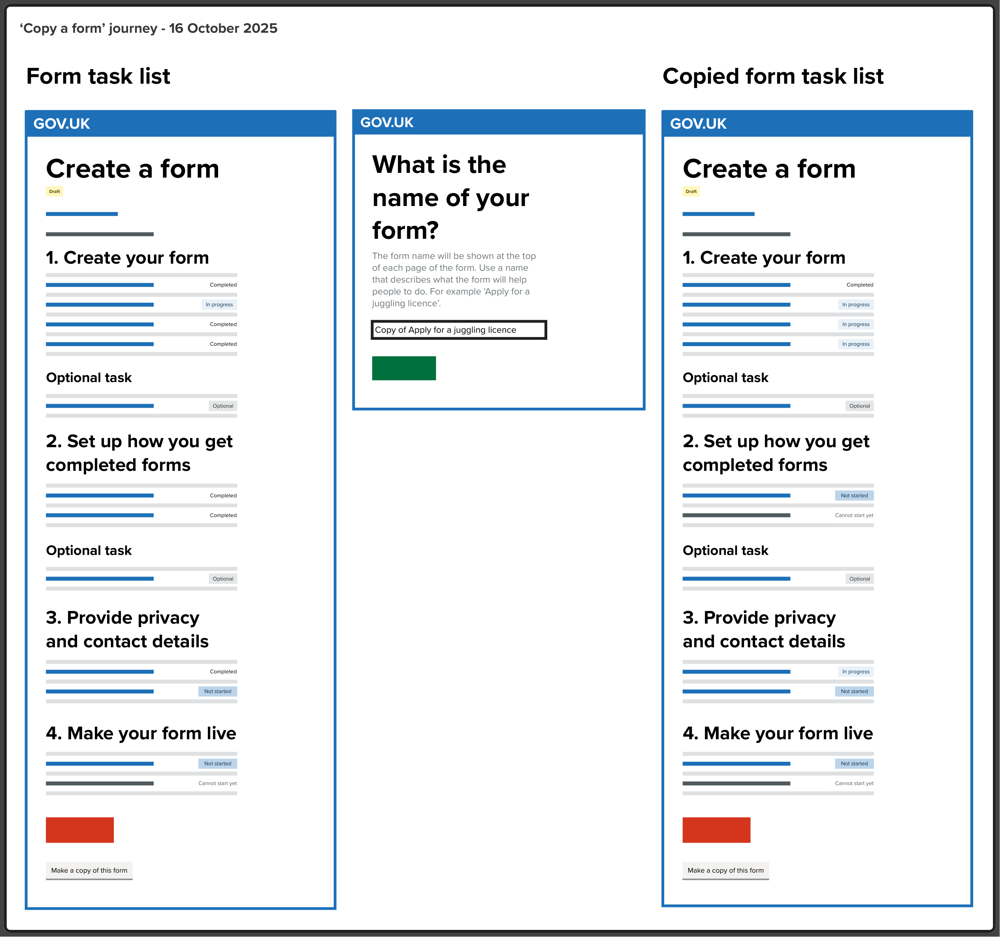
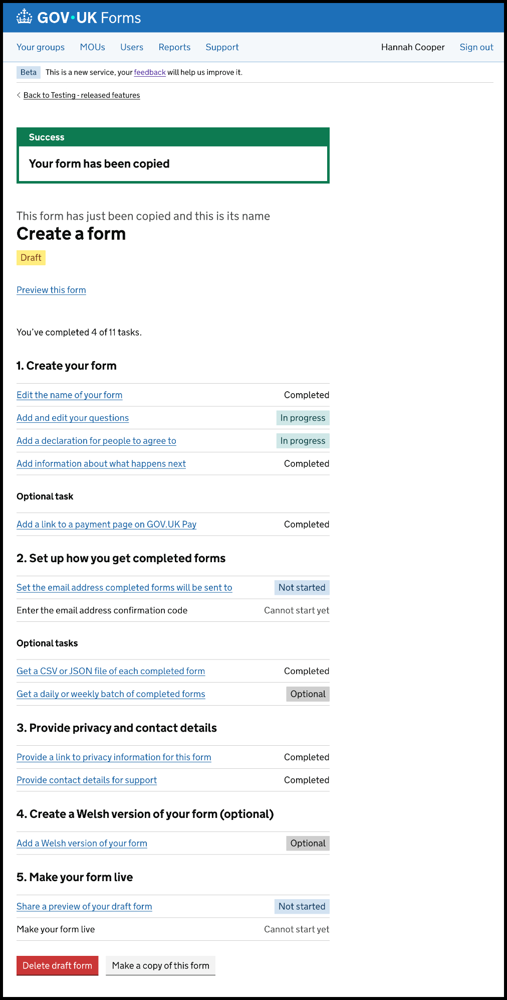

# Copy a form
- Date released: December 2025 
- [Epic Trello card](https://trello.com/c/TSyn5uhu/78-making-a-copy-of-a-form)
- [Make a copy of a form feature document](https://docs.google.com/document/d/1mu9U3D3IpRK6Y14jQY7BiKmkL5RfuBsZ8h5BT1y2okI/edit?usp=sharing) 
___

## Contents

- [What is this iteration](#what-is-this-iteration)
- [Scoping decisions](#scoping-decisions)
- [Design and content](#design-and-content)

___

## What is this iteration?

This added the ability for form creators - both standard users and organisation admins - to copy an existing draft, live or archived form. 

### Before

Form creators cannot copy forms. If they need to create a form that is very similar to another form, they have to manually create it from scratch.

### After

Form creators - both standard users and organisation admins - can make a copy of an existing draft, live or archived form. 

### Why?

This was a requested feature from multiple departments and emerged as a high priority feature at a workshop with organisation admins. 

People have varied overlapping needs. People want to be able to:  

- easily reuse standard questions or settings
- easily make multiple similar forms
- save time and reduce risk of mistakes when making similar forms or questions manually

___

## Scoping decisions

We talked through the options for an initial MVP to allow people to copy forms. We agreed what was in scope, and what was out of scope, for this iteration. 

### In scope

- A user can make a copy of any form (draft/archived/live) they have access to 
- The copy will be in draft state
- The copy will be made in the same group as the original form
- A form in any state can be copied (no matter how little is in it)

### Out of scope:

- Template forms that are open to all users in an organisation to make copies from
- Copying submission email details - we agreed these should have to be verified again
- Sending email notifications to users when a form is copied

___   

## Design and content

### The copy a form journey 

We agreed to mimic the current 'create a form' journey. When someone clicks the button to ‘copy a form’ we’d take them to the page to name their form. The form name would be pre-filled with 'Copy of' added to the front of the original form’s name. This would give them the opportunity to rename the form before they get to the task list - and reduce the risk of having multiple forms with the same name.

This image shows the 3 pages in the journey for copying a form. 

The first page shows the ‘Create a form’ task list for a draft form. The task list is unchanged other than the addition of a new grey button at the bottom with the text: ‘Make a copy of this form’. If you select this button, you’ll be taken to the next page.

The second page is the ‘What is the name of your form?’ page. The input field is pre-filled with the name ‘Copy of Apply for a juggling licence’ as an example. People have the opportunity to change this name and then click ‘Save and continue’. This takes them to the next page.

The third page is the ‘Create a form’ tasklist for the new copied form. It’s exactly the same as the original form’s task list except for the status of each task. The ‘Name your form’ task is ‘completed’.

### The status of the tasks in a copied form 

We originally agreed that after copying a form and saving its new name, the tasks in the tasklist for that form would keep any content that had been copied but would all be reset to ‘In progress’, ‘Not started’ or ‘Cannot start yet’. The exceptions would be:

- the ‘name your form’ task (that would be ‘Completed’)
- the tasks to set your submission email address (they would be cleared and ‘Not started’).

We later changed this for some tasks for technical reasons. Any of the tasks that are automatically marked ‘completed’ by the task list if they have content added to them, would still say ‘Completed’. This applies to: 

- Information about what happens next
- Payment link
- Get a CSV or JSON file of each completed form
- Privacy information
- Contact details for support

The tasks to ‘add and edit your questions’ and ‘Add a declaration’ would be ‘In progress’.

The screenshot above shows the tasklist of a form that has just been copied.

At the top there’s a green ‘Success’ banner with the words ‘Your form has been copied’. This would only be shown once. 

Beneath the banner is the ‘Create a form’ task list. The task sections, tasks and their statuses are: 

1. Create your form
  - Edit the name of your form - Completed
  - Add and edit your questions - In progress
  - Add a declaration for people to agree to - In progress
  - Add information about what happens next - Completed
  - Optional task: Add a link to a payment page on GOV.UK Pay - Completed
2. Set up how you get completed forms
  - Set the email address completed forms will be sent to - Not started
  - Enter the email address confirmation code - Cannot start yet
  - Optional task: Get a CSV or JSON file of each completed form - Completed
3. Provide privacy and contact details
  - Provide a link to privacy information for this form - Completed
  - Provide contact details for support - Completed
4. Make your form live
  - Share a preview of your draft form - Not started
  - Make your form live - Cannot start yet

Beneath the task list there are two buttons. A red ‘Delete draft form’ button and a grey ‘Make a copy of this form’ button. 

### The ‘Make a copy of this form’ button

We added a grey secondary action button to initiate copying of a form. The button text is “Make a copy of this form” and the button appears in these locations: 

- on a draft form’s tasklist page
- on a live form’s details page
- on an archived form’s details page

___   

   

[Back to the top](#copy-a-form)  
