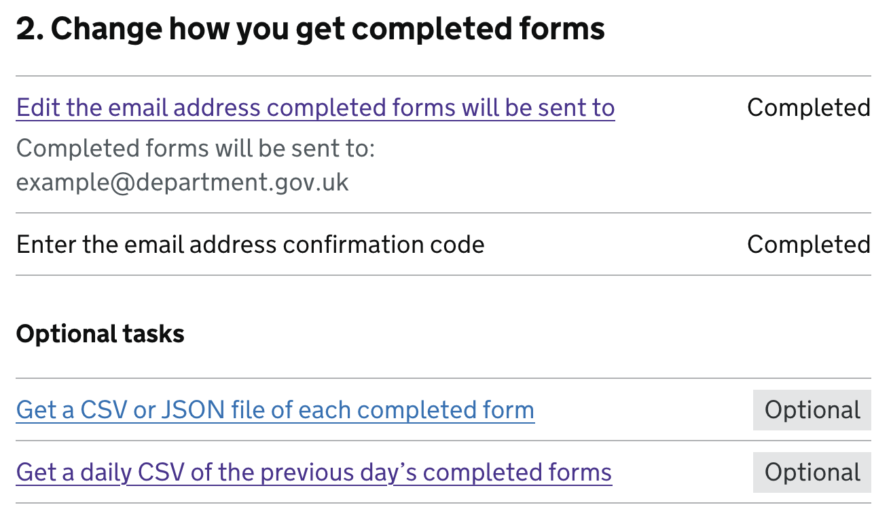
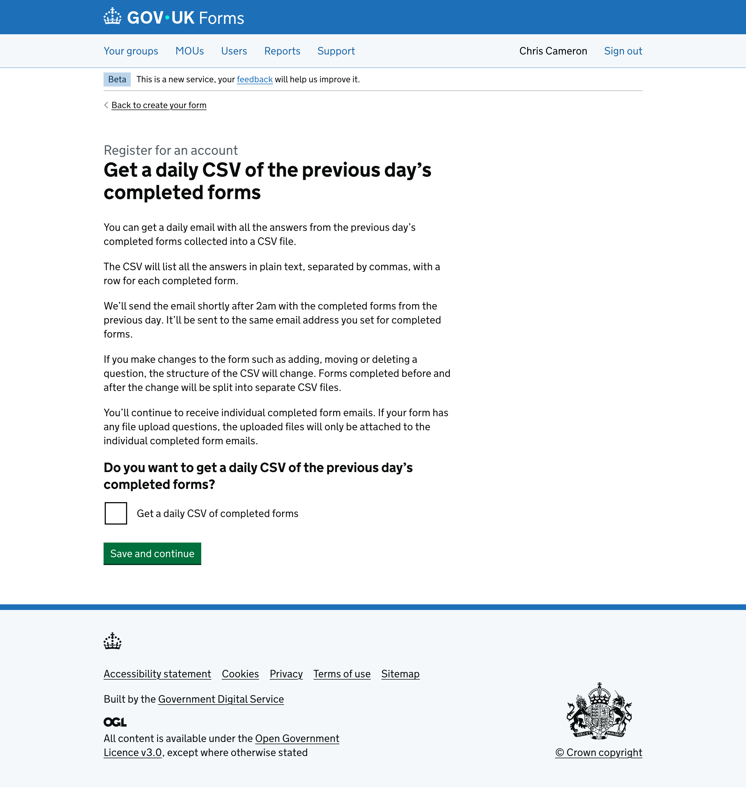
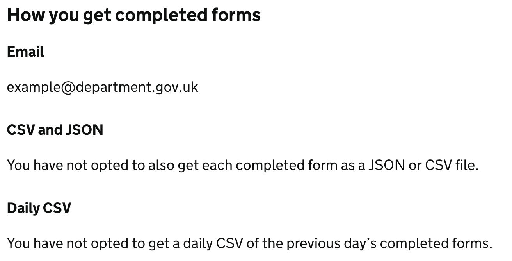
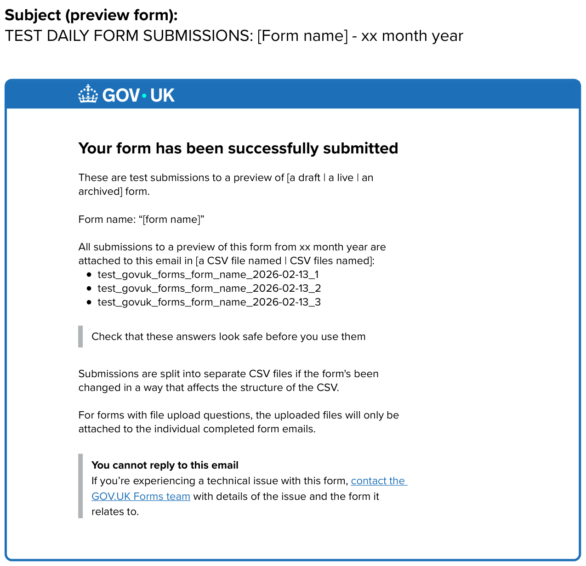

# Daily batch of submissions  

- Date released: March 2026   
- [Epic Trello card](https://trello.com/c/KsrXbLgd/156-collating-submissions-into-one-file?search_id=3eb9774f-544c-443c-b460-b717ba991c23)  
___

## Contents

- [What is this iteration](#what-is-this-iteration)  
- [Design and content](#design-and-content)  

___

## What is this iteration?  

This added the option for form owners to get a daily email with an attached CSV file containg all submissions to a single form for the previous day. This email will not contain any uploaded files and so will be alongside existing inidividual submissions.  

### As-is  

Form creators get answers from each completed form sent to them by email or through an S3 bucket, which is less common.  

### To-be  

People can also opt to receive a collated version of all the submissions to a form for a previous day.  

### Why?  

We believe providing a daily collation of submissions will help some users of the form data get a better idea of how forms are working and what might be causing issues with people completing their forms. It can also be used to get a better understanding of the contact types allowing future iteration or simplification.   

## Design and content  
  
The designs and content changed for this iteration were:  

### Task list  
  
 

As part of the work to include the new collated CSV as an option for form creators to pick form we added a new optional task as part of the task list section 2 “Change how you get completed forms”.  

The section still shows the link to edit the email address completed forms are sent to with the previously set email that submissions are currently sent to beneath. Then the task to enter the confirmation code we sent to the email to confirm they had access. It reads:  

> 2\. Change how you get completed forms  
>  
> Edit the email address compelted forms will be sent to (link) : Completed  
> Completed forms will be sent to: example@department.gov.uk  
>  
> Enter the email address confirmation code (unlinked) : Completed  

Under the original tasks is the existing ‘optional task’ to “Get a CSV or JSON file of each compelted form” which has not been selected so remains with the status tag ‘optional’ alongside.  

Next is the new optional task added:  

> Get a daily CSV of the previous day’s completed forms : Optional  

Since adding the new second optional task we also updated the subsection heading from ‘Optional task’ to ‘Optional tasks’.  

    
### Get a daily CSV of the previous day’s completed forms  
  
  

This is the newly added task screen providing information about the feature and what it does and does not offer, with the option for the form creator to pick if they recieve the new file. The page reads:  

> H1: Get a daily CSV of the previous day’s completed forms  
>  
> You can get a daily email with all the answers from the previous day’s completed forms collected into a CSV file.  
>  
> The CSV will list all the answers in plain text, separated by commas, with a row for each completed form.  
>  
> We’ll send the email shortly after 2am with the completed forms from the previous day. It’ll be sent to the same email address you set for completed forms.  
>  
> If you make changes to the form such as adding, moving or deleting a question, the structure of the CSV will change. Forms completed before and after the change will be split into separate CSV files. 
>  
> You’ll continue to receive individual completed form emails. If your form has any file upload questions, the uploaded files will only be attached to the individual completed form emails.  

Finally the page ends with the question “Do you want to get a daily CSV of the previous day’s completed forms?” and a single checkbox for the form creator to select or deselect:  

> Get a daily CSV of completed forms  

### How you get completed forms - read-only view  
  
 

As part of this release we are showing a new subsection on the live form read-only version as part of the “How you get completed forms” section. Beneath the set email and whether they have chosen to receive a CSV or JSON as part of the individual email submissions we have a new “Daily CSV” heading. It informs the person looking at this page whether the form is also set up to receive a daily CSV of all previous day’s submissions. The screenshot shows:  

> H3: How you get completed forms  
>  
> H4: Email   
> example@department.gov.uk  
>  
> H4: CSV and JSON    
> You have not opted to also get each completed form as a JSON or CSV file.  
>   
> H4: Daily CSV   
> You have not opted to get a daily CSV of the previous day’s completed forms.  

The last line of which would change to read “You are getting a daily CSV of the previous day’s completed forms.” if the form creator has decided they want a daily CSV file.  

### Daily collation email - live version  
  
 

This is an example of the new daily email that will be sent to the processing email. 

- The email will be sent just after 2am each day and contain all submissions from the previous day collated into a single CSV file.  
- The CSV will not include uploaded files from the form but will include the associated file name for the form processors to be able to link the submission and file.  

The email subject line for live forms reads: 

> Daily form submissions: ‘[Form name]’ - xx month year

The email reads: 

> Form name: “[form name]”  
>  
> All submissions to this form from xx month year are attached to this email in [a CSV file named | CSV files names]:  
> - govuk_forms_form_name_2026-02-13_1  
> - govuk_forms_form_name_2026-02-13_2  
> - govuk_forms_form_name_2026-02-13_3  
>   
> > Check that these answers look safe before you use them  
>  
> Submissions are split into separate CSV files if the form’s been changed in a way that affects the structure of the CSV.  
>  
> For forms with file upload questions, the uploaded files will only be attached to the individual completed form emails.  
>  
> > **You cannot reply to this email**
> > 
> > If you’re experiencing a technical issue with this form, contact the GOV.UK Forms team (linked) with details of the issues and the form it relates to.   

### Daily collation email - preview version  
  
 

   
  
___

   
  
[Back to the top](#daily-batch-of-submissions)  
