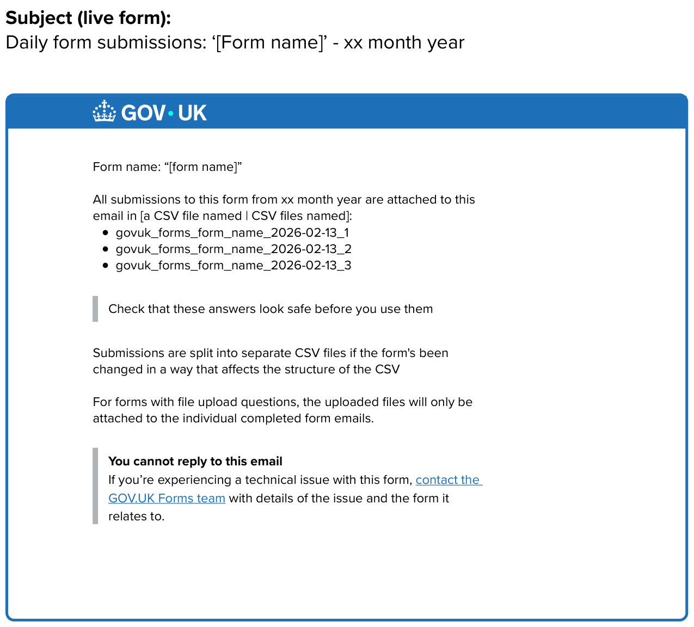

# Daily batch of submissions

- Date released: March 2026   
- [Epic Trello card](https://trello.com/c/KsrXbLgd/156-collating-submissions-into-one-file?search_id=3eb9774f-544c-443c-b460-b717ba991c23)
___

## Contents

- [What is this iteration](#what-is-this-iteration)
- [Design and content](#design-and-content)

___

## What is this iteration?

This added the option for form owners to get a daily email with an attached CSV file containg all submissions to a single form for the previous day. This email will not contain any uploaded files and so will be alongside existing inidividual submissions.  

### As-is

Form creators get answers from each completed form sent to them by email or through an S3 bucket, which is less common.  

### To-be  

People can also opt to receive a collated version of all the submissions to a form for a previous day. 

### Why?

We believe providing a daily collation of submissions will help some users of the form data get a better idea of how forms are working and what might be causing issues with people completing their forms. It can also be used to get a better understanding of the contact types allowing future iteration or simplification.  

## Design and content  
  
The designs and content changed for this iteration were: 

### Task list
  
  
    
### Get a collation
  
  
    
### Read-only Live view
  
 
    
### Daily collation email - live version  
  
 
    
### Daily collation email - preview version  
  
 

   
  
___

   
  
[Back to the top](#daily-batch-of-submissions)  
