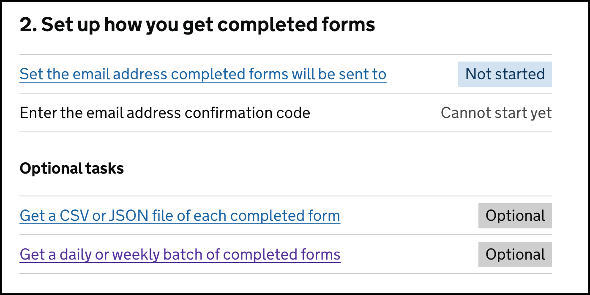
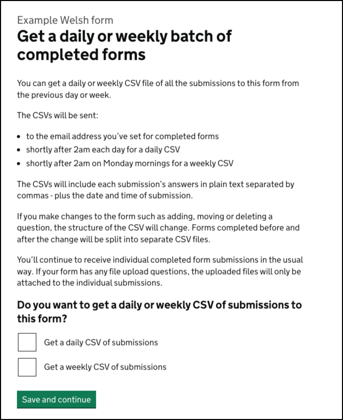

# Weekly batch of submissions

- Date released: 30 March 2026
- [Epic Trello card](https://trello.com/c/KsrXbLgd/156-collating-submissions-into-one-file)
- [Daily and weekly collated submissions CSV - Mural](https://app.mural.co/t/gaap0347/m/gaap0347/1770127108440/d7a891c1cc0123b6ccbb35e593bb7b00ce38d083?sender=u12d19b597a88e8b64fc22126)
- [Daily and weekly CSV of form submissions - content notes](https://docs.google.com/document/d/1aHnUZ6RWI2aj9yi-MciAy-NexJzWtynNV2NEGZyioAc/edit?pli=1&tab=t.udaypy8b13up#heading=h.6iwzmd16d9b8)
---

## Contents

- [What is this iteration](#what-is-this-iteration)
- [Design and content](#design-and-content)

---
## What is this iteration?  

This added the option for form owners to get a weekly email with an attached CSV file containing all submissions to a single form from the previous week. The email does not contain any uploaded files for file upload questions, so individual submissions continue as normal.  

### As-is  

Form creators get answers from each completed form sent to them by email or through an S3 bucket (which is less common). They can also get a daily batch of submissions to a form as a CSV file attached to an email.  

### To-be  

People can also opt to receive a weekly batch of submissions in a CSV file, with all the submissions to a form from the previous week. The CSV is sent on a Monday morning to the email address that is set for completed forms.

### Why?  

We know many of our users currently collect individual submission data into a single spreadsheet file for various reasons - such as for processing, record keeping and analysing response data in bulk. 

We provided daily batches as a first iteration to help people to do this more easily. We are expanding this to a weekly batch to, hopefully, make further efficiency improvements. 

---
## Design and content  
  
The designs and content changed for this iteration were:  

### Task list  

In section 2 of the task list, pictured above, we changed the name of the existing optional weekly batch task from: 

> Get a daily CSV of the previous day’s completed forms

To: 

> Get a daily or weekly batch of completed forms

This introduced the terminology of ‘batches’ for the first time. This was needed to avoid having to say “all of the completed forms from the previous day or week”.

### Task page: Get a daily or weekly batch of completed forms

The task page has a new heading and content - including an additional checkbox - to explain the options of daily and weekly batches of form submissions, and allow the form creator to select if they want either of them. 

  

The new H1 heading is:

> Get a daily or weekly batch of completed forms

Then there is some guidance: 

> You can get a daily or weekly CSV file of all the submissions to this form from the previous day or week.
> 
> The CSVs will be sent: 
> - to the email address you’ve set for completed forms 
> - shortly after 2am each day for a daily CSV
> - shortly after 2am on Monday mornings for a weekly CSV
> 
> The CSVs will include each submission’s answers in plain text separated by commas - plus the date and time of submission. 
> 
> If you make changes to the form such as adding, moving or deleting a question, the structure of the CSV will change. Forms completed before and after the change will be split into separate CSV files.
> 
> You’ll continue to receive individual completed form submissions in the usual way. If your form has any file upload questions, the uploaded files will only be attached to the individual submissions.

Then a question: 

> Do you want to get a daily or weekly CSV of submissions to this form?

Followed by 2 checkbox options: 

> - Get a daily CSV of submissions
> - Get a weekly CSV of submissions

Then a green ‘Save and continue’ button. 

#### Success banner notifications

If the form creator changes the current settings on the task page and saves them, they are returned to the task list page and the relevant success banner will be displayed. There are 4 versions: 

- You’ll get a daily batch of form submissions
- You’ll get a weekly batch of form submissions
- You’ll get daily and weekly batches of form submissions
- You will not get a daily or weekly batch of form submissions

If the form creator makes no changes, no success banner is displayed when they return to the task list page. 

### Live and archived form’s details page

On the live or archived form’s read-only details page we display the form’s current settings for daily and weekly batches. 

In the “How you get completed forms” section, we show an H3: 

>  Daily and weekly CSVs

Beneath this, we show the relevant line of the 4 possibilities: 
- You are getting a daily batch of completed forms.
- You are getting a weekly batch of completed forms.
- You are getting daily and weekly batches of completed forms.
- You have not opted to get a daily or weekly batch of completed forms.

### Weekly batch emails
  
The weekly batch email will: 
- be sent on Mondays shortly after 2am at a similar time to the daily batch emails 
- include CSVs for the previous week’s submission to the form
- not include any file uploads from file upload questions - these will only be sent with the individual submissions 

We’ve adapted the daily batch email template for weekly batches. 

The subject for the email is: 

> Weekly form submissions: ‘[Form name]’ - xx month year to xx month year

The body content is: 

> Form name: “[form name]”  
>  
> All submissions to this form from xx month year to xx month year are attached to this email in [a CSV file named | CSV files named]:  
> - govuk_forms_form_name_2026-02-13--2026-02-19_1
> - govuk_forms_form_name_2026-02-13--2026-02-19_2  
> - govuk_forms_form_name_2026-02-13--2026-02-19_3  
>   
> > Check that these answers look safe before you use them  
>  
> Submissions are split into separate CSV files if the form’s been changed in a way that affects the structure of the CSV.  
>  
> For forms with file upload questions, the uploaded files will only be attached to the individual completed form submissions.  
>  
> > **You cannot reply to this email**
> > 
> > If you’re experiencing a technical issue with this form, contact the GOV.UK Forms team (linked) with details of the issue and the form it relates to.   

#### Preview version of the email

Any submission to a preview of the form will be sent in a separate CSV in a separate email. They’ll be clearly marked as test submissions. This allows people to test this functionality, without getting them confused as real submissions.

The email template is largely the same with the following difference. 

The email subject line reads: 

> TEST WEEKLY FORM SUBMISSIONS: [Form name] - xx month year to xx month year

We include a line at the start of the body of the email to say: 

> These are test submissions to a preview of [a draft | a live | an archived] form.

We have also added “test_” to the start of each attached CSV filename to differentiate these files even if they are downloaded to a user’s computer.

   
  
___

   
  
[Back to the top](#weekly-batch-of-submissions)  
