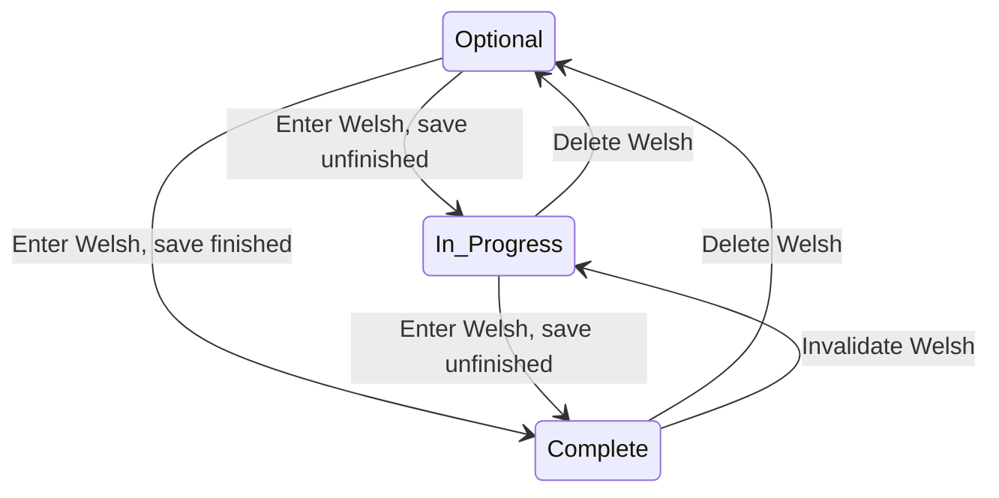

# Adding Welsh to a Form

This document describes how adding a Welsh translation affect a form and it's form documents.

## The Welsh tasklist status

The Welsh task is optional. If the form creator does nothing, it will not block the form from being made live.

If the task is started, by entering any values into the translation screen and submitting it as unfinished, the status will be set to in progress.

The form cannot be made live while the Welsh task is in progress.

If the task is completed, by entering a full translation of the form and submitting it as finished, the status will be set to complete and the form can be made live.

Any changes to the form or translation which would mean that the Welsh is no longer complete, such as adding a declaration, new question, exit page or support method will 
set the status to in progress.

## New fields on Form

## available_languages

`available_languages`, is an array of language codes. It's `[:en]` by default, which signals that the form is only available in English.
Forms with a Welsh translation have `[:en, :cy]` in the array.

As soon as the Welsh translation page is submitted with at least one value for a field, the `available_languages` array will be updated.

The `available_languages` array is used when generating form documents, which are used by the runner. Form documents are created for each language in the array.
It's updated when the Welsh translation is submitted so the user can immediately preview the Welsh translation, even if they haven't completed it.

The `available_languages` array is saved in form documents. It's used by the runner to discover that the form is available in Welsh, if it's showing the English version.

### welsh_completed
`welsh_completed` is a boolean, which is records if the form creator has marked the Welsh as complete. It's not included in form_documents.

## Places where the values change

If the English form changes, we need to update the Welsh translation to match. This can happen if the form creator deletes a field, such as a declaration.
To keep the Welsh translation in sync, Form has a new method
`normalise_welsh!`. It's called when the form documents for draft or live are
made. It ensures that the Welsh translation doesn't have any values which the
English form doesn't have.

The method on Form in turn calls `normalise_welsh!` on each page and condition, which syncs these values.
